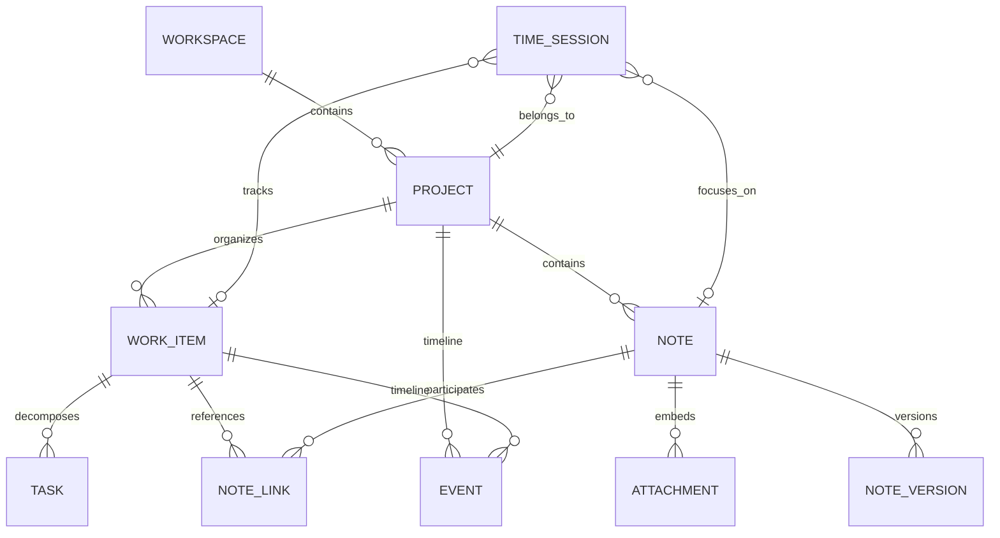

# Domain model

## Aggregate overview

## Workspace

A top-level context such as Research, Teaching, Languages, Personal, or Chronicle Development.

Required fields:

- `id`
- `name`
- `created_at`
- `updated_at`

Optional fields:

- icon
- accent token
- default templates
- archival state

Invariant: a workspace can be archived but not physically removed while dependent entities remain, unless the user confirms a cascading export or deletion.

## Project

A bounded objective with status, lifecycle, and reporting context.

Examples:

- Orf9b metastable states
- Chemistry course for school students
- Chronicle Android v1

Core fields:

- `workspace_id`
- title
- description
- status: `planned | active | paused | completed | archived`
- start and target dates
- optional budget in minutes or money
- default billing and timer settings

## Work item

The central unit of purposeful work. It joins execution, documentation, and history.

A work item can represent:

- preparing a lecture;
- analyzing a trajectory;
- writing a report section;
- planning an experiment;
- implementing a feature.

Core fields:

- project
- title
- type
- status
- priority
- estimate
- next action
- outcome summary
- linked notes and files

A work item is not required for every time session, but serious project work should normally use one.

## Task

An actionable step. Tasks may be independent or children of a work item.

Statuses:

- inbox
- next
- in_progress
- waiting
- blocked
- done
- cancelled

A task may have subtasks, dependencies, due dates, recurrence, estimate, and completion timestamp.

Invariant: dependency cycles are forbidden.

## Note

A Markdown document with stable identity and optional frontmatter.

Types include:

- general
- lecture
- literature
- experiment
- analysis
- meeting
- daily
- protocol
- reference

A note may belong to a project, link to multiple work items, and embed attachments.

## Time session

A contiguous tracked or manually entered interval.

Fields:

- start, end, duration
- description
- project
- optional work item, task, note
- tags
- source: `timer | manual | imported | recovered`
- optional outcome and interruption reason

Invariant: a running session has a start but no end. By default only one running primary session is permitted.

## Event

An immutable timeline fact used to reconstruct project history.

Examples:

- note created or edited;
- task completed;
- timer stopped;
- attachment added;
- project status changed;
- result recorded.

Events are append-only. Corrections produce compensating events rather than rewriting history invisibly.

## Attachment

A file known to Chronicle. It has a stable ID, content hash, original name, MIME type, size, and relative vault path.

## Reference

A bibliographic record imported from BibTeX, DOI metadata, RIS, or manual entry. Notes cite references by stable citation key.

## Tag

A lightweight cross-cutting label. Tags are not used as a replacement for entity types or statuses.
