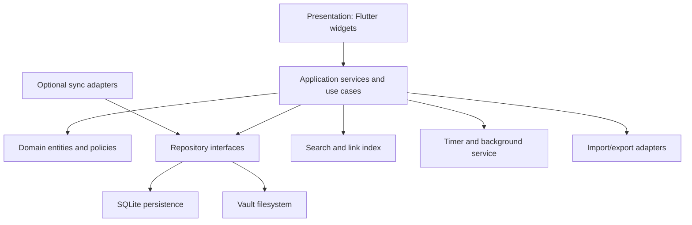

# System architecture

## Target platform strategy

- Flutter application for Android first.
- Shared domain, persistence, search, and editor packages suitable for Windows, Linux, and macOS.
- No dependency on a browser runtime for the primary application.

## Layering



## Package boundaries

Recommended Flutter layout:

```text
lib/
  app/
    bootstrap/
    navigation/
    theme/
  core/
    errors/
    ids/
    time/
    filesystem/
  domain/
    workspace/
    project/
    work_item/
    task/
    note/
    session/
    reference/
  application/
    commands/
    queries/
    services/
  infrastructure/
    database/
    vault/
    search/
    background/
    import_export/
  features/
    today/
    projects/
    tasks/
    notes/
    timer/
    insights/
    settings/
  shared/
    widgets/
    formatters/
```

## State management

Use Riverpod with explicit providers for repositories and use cases. Widget state remains local where possible. Domain entities must not depend on Flutter.

## Persistence

- SQLite via Drift for transactional structured data and migrations.
- Markdown and attachments in a user-selected vault.
- A reconciliation service keeps file metadata and the database index consistent.
- Database writes and vault writes use an operation journal to recover from partial failures.

## Search

Phase 1:

- SQLite FTS5 index for titles, Markdown text, task text, tags, and outcomes.

Phase 2:

- structured filters and saved views;
- optional local semantic index, never required for ordinary search.

## Editor

The editor is a staged component:

1. dependable Markdown source editor with rendered preview;
2. inline decorations and block rendering;
3. visual editing for common structures while preserving Markdown;
4. embeds, transclusion, citations, and callouts.

A Typora-like editor is a long-term goal, not a prerequisite for the first stable data model.

## Background timer

Android implementation requires:

- foreground service while a timer is running;
- persistent notification with pause/stop actions;
- elapsed time derived from timestamps, not repeated counter persistence;
- recovery after process death and device reboot;
- explicit battery optimization guidance.

## Error strategy

- domain failures are typed;
- user-facing messages explain recovery actions;
- logs avoid note contents and other private data by default;
- failed migrations stop safely and offer database export or restore.

## Testing pyramid

- domain unit tests;
- repository and migration integration tests;
- golden tests for stable UI components;
- widget tests for core flows;
- Android integration test for timer recovery and notification controls.
