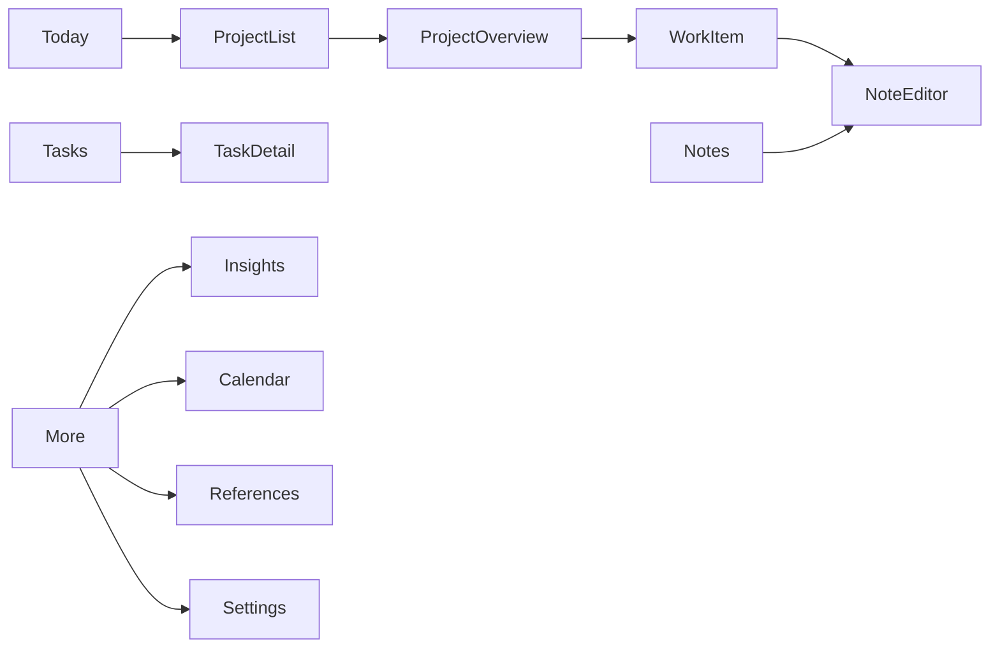

# Screen map

## Primary navigation

## Today

Purpose: resume work with minimal decision overhead.

Sections:

- active timer;
- continue where you stopped;
- next actions;
- scheduled or due work;
- today’s sessions and outcomes;
- quick capture.

## Project list

Views:

- active;
- planned;
- paused;
- completed;
- archived.

Supports workspace filtering and search.

## Project overview

Tabs or sections:

- Overview
- Work
- Notes
- Files
- Timeline
- Time
- Insights

## Work item detail

- outcome and next action;
- status and estimate;
- tasks;
- linked notes and files;
- session history;
- project timeline events.

## Notes

- recent;
- favorites;
- folders;
- types;
- tags;
- saved views;
- full-text search.

## Note editor

Phone modes:

- edit;
- read;
- properties sheet;
- backlinks sheet;
- outline sheet.

Desktop supports a split layout.

## Tasks

Views:

- Inbox
- Next
- In progress
- Waiting
- Blocked
- Done

Secondary views:

- project;
- calendar;
- kanban;
- saved query.

## Timer flow

1. Start from Today, project, work item, task, or note.
2. Confirm or edit description and context.
3. Run in foreground service.
4. Stop.
5. Optional outcome prompt: what changed, what is next?
6. Create timeline event and update actual time.

## Insights

- time by project, work type, tag, and date;
- estimate accuracy;
- session length distribution;
- interrupted versus completed sessions;
- outputs and completed tasks;
- no opaque universal productivity score.

## Settings

- vault location;
- backups;
- theme and accessibility;
- timer and Pomodoro;
- privacy;
- import/export;
- diagnostics;
- experimental features.
